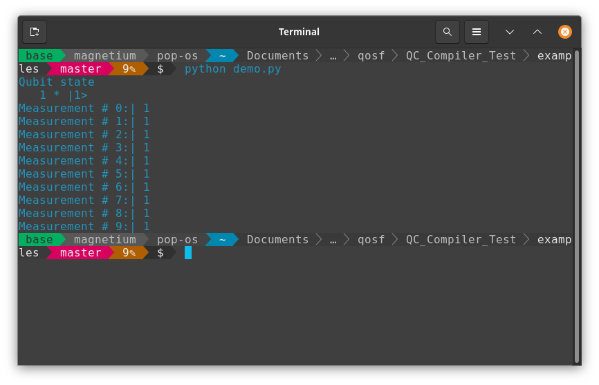

# QC_Compiler
## This repository contains a simple quantum computer simulator based on python.
#### This simulator was developed as submission for the QOSF Mentorship Application.

### Language and Dependencies
This program is written in Python 3. The following dependencies must be installed to run this simulator:
* numpy

### Task Description
Task instructions are located [here](https://github.com/quantastica/qosf-mentorship/blob/master/qosf-simulator-task.ipynb). 
Below are the basic requirements the simulator must accomplish:
* Initialize state
* Read a program (circuit)
* Performs the following tasks for each gate in the circuit:
  * Calculate the matrix operator
  * Apply the operator to modify the state
* Perform a multi-shot measurement of all qubits using weighted random technique
* Implement parametric gates.

### Using the simulator
As long as the proper dependencies are installed in the local environment, the two sourcecode files (operator.py and state.py) are all that is necessary to run the simulator, and can be imported as a package.
Eg,
#### Sample Program
```
import qcc
#Number Of Qubits
Nbits=1
#Applying X Gate
s=qcc.operator(Nbits).X(0)* qcc.state(Nbits)
# Print state
print("Qubit state")
print(s)
# Perform 10 measurements
for n in range(10):
    s0,v0=s.measure(0)   
    # And print results of state and classical bits
    print("Measurement # %d:| %d" % (n,v0))
```
#### Sample Output

### Designing the Circuit
The circuit can accept the following gates:
Regular Unary Gates | Parameterized Unary Gates | Binary Gates
------------------- | ------------------------- | -------------
X, H | Rz  | CNOT(CX)  
* The number of Qubits are passed in operator to initialize the qubit state.
* Gates can be applied by passing it along operator.
  - Gate - given as a UpperCase string for the gate (x, h, cx). 
* Method `operator(Nbits)`: should be passed to initialize the qubits.
* Method `measure(q_num)`: when run on a `qcc` object, this will return the result of `number_of_shots` runs of the circuit for a single measurement (Can be run multiple times for a multi-shot measurements).
* Method `print(qcc_obj)` : print the state of the qubit object.
